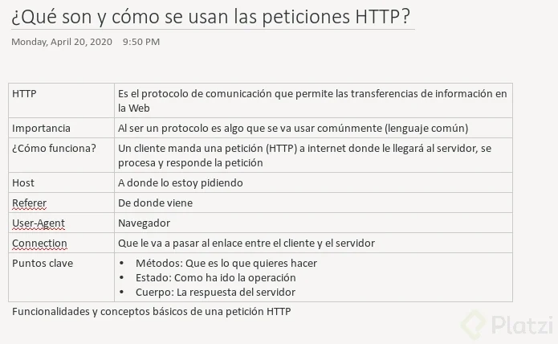

# Curso de Node.js - Carlos Hernández

## 3. ¿Qué son y cómo se usan las peticiones HTTP?

## 4. Métodos, cabeceras y estados

Métodos HTTP:

    GET: Recoger información del servidor.
    POST: Añadir información al servidor.
    PUT: Reemplazar información en el servidor.
    PATCH: Actualizar parte de la información.
    DELETE: Eliminar información del servidor.
    OPTIONS: Pedir información sobre métodos (saber si podemos ejecutar alguno de los métodos anteriores).

Las cabeceras serán el envío al servidor de cómo queremos hacer la petición.

Los estados son números que indica el estado de la petición:

    2XX: Todo ha ido bien.
    3XX: La petición se ha redirigido.
    4XX: Errores del cliente.
    5XX: Ha habido un error al procesar la petición.

## 4. Cuerpo y query de la petición

    El cuerpo de la petición es la información en sí que queremos enviar, editar o que el servidor nos devuelva.
    Las queries van a permitirte añadir información extra a los datos que queramos enviarle al servidor.

## 18. Tipos de Bases de Datos: Relacionales y No Relacionales

    Bases de Datos Relacionales: no es una base de datos muy flexible,  
    pero tiene a favor su gran soporte y el enorme desarrollo en herramientas para   
    su uso. Si necesitamos cambiar un valor de un campo debemos hacerlo con todos 
    los campos de nuestra BD, en cambio con NoSQL o No Relacional no es así.

    Bases de Datos No Relacionales: son de bases de datos sin una tabla fija como 
    las que sí se encuentran en las bases de datos relacionales, lo que permite una 
    alta escalabilidad en ellas. Además, es abierta y por lo tanto flexible a 
    diferentes tipos de datos y no necesita tantos recursos para ejecutarse; de 
    hecho, el hardware necesario no cuesta mucho.

[tipos](https://platzi.com/comentario/885553/)